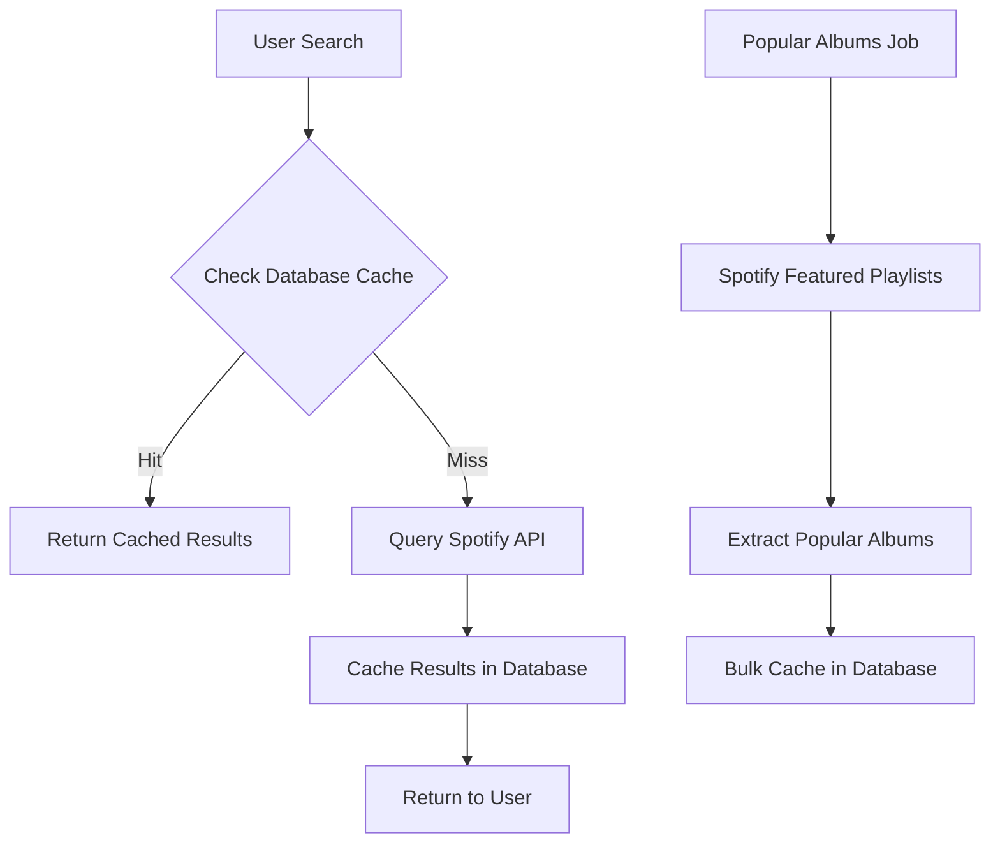

# Musicboxd Architecture Documentation
> Production System Design & Technical Specifications

## 🏗 **System Overview**

Musicboxd is built as a **mobile-first social music platform** using a modern React Native frontend with a cloud-native backend architecture optimized for cost-effectiveness and rapid scaling.

### **Architecture Principles**
- **Mobile-First**: iOS primary platform, Android secondary
- **Cost-Optimized**: Leverage free tiers and managed services
- **Speed-to-Market**: Minimize custom infrastructure
- **Social-Ready**: Real-time features and user interactions
- **API-Driven**: External music data integration

---

## 🛠 **Technology Stack**

### **Frontend - React Native**
```javascript
// Core Framework
React Native 0.80.1 + TypeScript
├── State Management: Redux Toolkit + React Redux
├── Navigation: React Navigation 7 (Stack + Bottom Tabs)
├── UI Framework: React Native Paper (Material Design 3)
├── Build System: Metro + Babel
└── Package Manager: npm
```

**Key Dependencies:**
- `@react-navigation/native` - Navigation system
- `@reduxjs/toolkit` - State management
- `react-native-paper` - UI components
- `@supabase/supabase-js` - Backend integration
- `react-native-gesture-handler` - Touch interactions

### **Backend - Supabase (Cloud)**
```sql
-- Core Services
Supabase Platform
├── Database: PostgreSQL 15+ with Row Level Security
├── Authentication: OAuth (Google, Apple) + JWT
├── Real-time: WebSocket subscriptions
├── Storage: File uploads (profile pictures)
├── Functions: Edge Functions (Deno runtime)
└── Analytics: Built-in usage tracking
```

**Service Benefits:**
- **Database**: Auto-generated REST APIs, real-time subscriptions
- **Auth**: Pre-built social login flows, secure session management
- **Storage**: CDN-backed file storage with automatic optimization
- **Scaling**: Automatic scaling with usage-based pricing

### **External APIs**
```yaml
Music Data Sources:
  Primary: Spotify Web API
    - Coverage: 70M+ tracks
    - Rate Limit: 100 requests/second (free)
    - Features: Search, album metadata, artwork URLs
  
  Backup: MusicBrainz API
    - Coverage: Open music database
    - Rate Limit: 1 request/second (recommended)
    - Features: Comprehensive metadata, free/open source
```

---

## 🏛 **Database Schema Design**

### **Core Tables**

#### **Users Table**
```sql
users (
  id UUID PRIMARY KEY DEFAULT gen_random_uuid(),
  email TEXT UNIQUE NOT NULL,
  username TEXT UNIQUE NOT NULL,
  display_name TEXT NOT NULL,
  avatar_url TEXT,
  bio TEXT,
  is_public BOOLEAN DEFAULT true,
  created_at TIMESTAMP WITH TIME ZONE DEFAULT NOW(),
  updated_at TIMESTAMP WITH TIME ZONE DEFAULT NOW()
);
```

#### **Albums Table** (Music Data Cache)
```sql
albums (
  id TEXT PRIMARY KEY,              -- Spotify album ID
  name TEXT NOT NULL,
  artist_name TEXT NOT NULL,
  artist_id TEXT,
  image_url TEXT,
  release_date DATE,
  popularity INTEGER DEFAULT 0,
  track_count INTEGER,
  duration_ms INTEGER,
  genres TEXT[],
  spotify_data JSONB,              -- Full Spotify API response
  musicbrainz_id TEXT,             -- Backup data source
  cache_expires_at TIMESTAMP WITH TIME ZONE,
  created_at TIMESTAMP WITH TIME ZONE DEFAULT NOW()
);

-- Indexes for performance
CREATE INDEX albums_name_search ON albums USING gin(to_tsvector('english', name));
CREATE INDEX albums_artist_search ON albums USING gin(to_tsvector('english', artist_name));
CREATE INDEX albums_popularity ON albums (popularity DESC);
```

#### **User Albums** (Listening History)
```sql
user_albums (
  id UUID PRIMARY KEY DEFAULT gen_random_uuid(),
  user_id UUID REFERENCES users(id) ON DELETE CASCADE,
  album_id TEXT REFERENCES albums(id) ON DELETE CASCADE,
  status TEXT CHECK (status IN ('listened', 'want_to_listen', 'currently_listening')),
  rating INTEGER CHECK (rating >= 1 AND rating <= 5),
  review_text TEXT,
  listened_at DATE,
  created_at TIMESTAMP WITH TIME ZONE DEFAULT NOW(),
  updated_at TIMESTAMP WITH TIME ZONE DEFAULT NOW(),
  
  UNIQUE(user_id, album_id)
);

-- Indexes for user queries
CREATE INDEX user_albums_user_listened ON user_albums (user_id, listened_at DESC);
CREATE INDEX user_albums_user_rating ON user_albums (user_id, rating DESC) WHERE rating IS NOT NULL;
```

#### **Social Connections**
```sql
follows (
  id UUID PRIMARY KEY DEFAULT gen_random_uuid(),
  follower_id UUID REFERENCES users(id) ON DELETE CASCADE,
  following_id UUID REFERENCES users(id) ON DELETE CASCADE,
  created_at TIMESTAMP WITH TIME ZONE DEFAULT NOW(),
  
  UNIQUE(follower_id, following_id),
  CHECK (follower_id != following_id)
);

-- Indexes for social queries
CREATE INDEX follows_follower ON follows (follower_id);
CREATE INDEX follows_following ON follows (following_id);
```

#### **Activity Feed**
```sql
activities (
  id UUID PRIMARY KEY DEFAULT gen_random_uuid(),
  user_id UUID REFERENCES users(id) ON DELETE CASCADE,
  album_id TEXT REFERENCES albums(id) ON DELETE CASCADE,
  activity_type TEXT CHECK (activity_type IN ('rated', 'listened', 'reviewed')),
  metadata JSONB,                  -- Activity-specific data (rating, review text, etc.)
  created_at TIMESTAMP WITH TIME ZONE DEFAULT NOW()
);

-- Indexes for feed generation
CREATE INDEX activities_user_time ON activities (user_id, created_at DESC);
CREATE INDEX activities_feed_time ON activities (created_at DESC);
```

### **Row Level Security (RLS) Policies**

```sql
-- Users can only update their own profile
ALTER TABLE users ENABLE ROW LEVEL SECURITY;
CREATE POLICY users_update_own ON users FOR UPDATE USING (auth.uid() = id);

-- Users can only see their own album data
ALTER TABLE user_albums ENABLE ROW LEVEL SECURITY;
CREATE POLICY user_albums_own ON user_albums FOR ALL USING (auth.uid() = user_id);

-- Users can only follow/unfollow as themselves
ALTER TABLE follows ENABLE ROW LEVEL SECURITY;
CREATE POLICY follows_own ON follows FOR ALL USING (auth.uid() = follower_id);

-- Activity visibility based on user privacy settings
ALTER TABLE activities ENABLE ROW LEVEL SECURITY;
CREATE POLICY activities_visible ON activities FOR SELECT USING (
  -- Own activities always visible
  auth.uid() = user_id OR
  -- Public users' activities visible to followers
  (
    EXISTS (SELECT 1 FROM users WHERE id = activities.user_id AND is_public = true) AND
    EXISTS (SELECT 1 FROM follows WHERE following_id = activities.user_id AND follower_id = auth.uid())
  )
);
```

---

## 🔄 **Data Flow Architecture**

### **Music Data Caching Strategy**

#### **3-Tier Caching System**



#### **Tier 1: Popular Albums Cache**
```javascript
// Weekly job to cache popular albums
async function cachePopularAlbums() {
  const playlists = await spotify.getFeaturedPlaylists({ limit: 50 });
  const albums = new Set();
  
  for (const playlist of playlists.items) {
    const tracks = await spotify.getPlaylistTracks(playlist.id);
    tracks.items.forEach(item => {
      if (item.track?.album) {
        albums.add(item.track.album);
      }
    });
  }
  
  // Cache albums with 30-day expiration
  await supabase.from('albums').upsert(
    Array.from(albums).map(album => ({
      ...formatSpotifyAlbum(album),
      cache_expires_at: new Date(Date.now() + 30 * 24 * 60 * 60 * 1000)
    }))
  );
}
```

#### **Tier 2: User-Searched Albums Cache**
```javascript
// Smart search with caching
async function searchAlbums(query, userId) {
  // 1. Check database cache first
  const { data: cachedAlbums } = await supabase
    .from('albums')
    .select('*')
    .or(`name.ilike.%${query}%, artist_name.ilike.%${query}%`)
    .order('popularity', { ascending: false })
    .limit(10);

  if (cachedAlbums.length >= 5) {
    return cachedAlbums;
  }

  // 2. Query Spotify API for more results
  const spotifyResults = await spotify.searchAlbums(query, { limit: 20 });
  
  // 3. Cache new results (30-day expiration)
  const newAlbums = spotifyResults.albums.items.map(album => ({
    ...formatSpotifyAlbum(album),
    cache_expires_at: new Date(Date.now() + 30 * 24 * 60 * 60 * 1000)
  }));
  
  await supabase.from('albums').upsert(newAlbums);
  
  // 4. Return combined results
  return [...cachedAlbums, ...newAlbums].slice(0, 20);
}
```

#### **Tier 3: Real-time API Fallback**
```javascript
// For rare/new albums not in cache
async function getAlbumDetails(albumId) {
  // Check cache first
  let { data: album } = await supabase
    .from('albums')
    .select('*')
    .eq('id', albumId)
    .single();

  if (!album || album.cache_expires_at < new Date()) {
    // Fetch from Spotify and cache
    const spotifyAlbum = await spotify.getAlbum(albumId);
    album = formatSpotifyAlbum(spotifyAlbum);
    
    await supabase.from('albums').upsert({
      ...album,
      cache_expires_at: new Date(Date.now() + 30 * 24 * 60 * 60 * 1000)
    });
  }

  return album;
}
```

---

## 🔐 **Authentication & Security**

### **OAuth Flow Implementation**
```javascript
// Google Sign-In Integration
import { GoogleSignin } from '@react-native-google-signin/google-signin';
import { supabase } from './supabase';

async function signInWithGoogle() {
  try {
    await GoogleSignin.hasPlayServices();
    const userInfo = await GoogleSignin.signIn();
    
    if (userInfo.idToken) {
      const { data, error } = await supabase.auth.signInWithIdToken({
        provider: 'google',
        token: userInfo.idToken,
      });
      
      if (error) throw error;
      
      // Create/update user profile
      await createOrUpdateUserProfile(data.user);
      
      return data;
    }
  } catch (error) {
    throw new Error(`Google Sign-In failed: ${error.message}`);
  }
}

// Apple Sign-In Integration
import { appleAuth } from '@invertase/react-native-apple-authentication';

async function signInWithApple() {
  try {
    const appleAuthRequestResponse = await appleAuth.performRequest({
      requestedOperation: appleAuth.Operation.LOGIN,
      requestedScopes: [appleAuth.Scope.EMAIL, appleAuth.Scope.FULL_NAME],
    });

    if (appleAuthRequestResponse.identityToken) {
      const { data, error } = await supabase.auth.signInWithIdToken({
        provider: 'apple',
        token: appleAuthRequestResponse.identityToken,
      });
      
      if (error) throw error;
      
      await createOrUpdateUserProfile(data.user, {
        displayName: `${appleAuthRequestResponse.fullName?.givenName} ${appleAuthRequestResponse.fullName?.familyName}`.trim()
      });
      
      return data;
    }
  } catch (error) {
    throw new Error(`Apple Sign-In failed: ${error.message}`);
  }
}
```

### **Security Measures**
1. **Row Level Security**: Database-level access control
2. **JWT Tokens**: Secure session management with automatic refresh
3. **API Rate Limiting**: Supabase built-in rate limiting
4. **Input Validation**: Server-side validation for all user inputs
5. **HTTPS Only**: All API communication encrypted
6. **OAuth Scopes**: Minimal permission requests

---

## 📱 **Frontend Architecture**

### **Redux Store Structure**
```typescript
// Store configuration
interface RootState {
  auth: AuthState;
  albums: AlbumsState;
  users: UsersState;
  social: SocialState;
  ui: UIState;
}

interface AuthState {
  user: User | null;
  session: Session | null;
  isLoading: boolean;
  error: string | null;
}

interface AlbumsState {
  searchResults: Album[];
  searchQuery: string;
  searchLoading: boolean;
  cachedAlbums: { [key: string]: Album };
  userAlbums: UserAlbum[];
  userAlbumsLoading: boolean;
}

interface SocialState {
  following: User[];
  followers: User[];
  activityFeed: Activity[];
  activityLoading: boolean;
  userSearch: {
    results: User[];
    query: string;
    loading: boolean;
  };
}
```

### **Service Layer Architecture**
```typescript
// API Service abstraction
class AlbumService {
  static async searchAlbums(query: string): Promise<Album[]> {
    // Implementation handles caching logic
  }
  
  static async getAlbumDetails(albumId: string): Promise<Album> {
    // Implementation handles cache-first strategy
  }
  
  static async rateAlbum(albumId: string, rating: number): Promise<void> {
    // Implementation handles user album updates
  }
}

class SocialService {
  static async followUser(userId: string): Promise<void> {
    // Implementation handles follow relationships
  }
  
  static async getActivityFeed(): Promise<Activity[]> {
    // Implementation handles privacy and following logic
  }
  
  static async searchUsers(query: string): Promise<User[]> {
    // Implementation handles user discovery
  }
}
```

---

## 🚀 **Deployment & Environment Strategy**

### **Environment Configuration**
```typescript
// Environment-specific configuration
interface EnvironmentConfig {
  supabaseUrl: string;
  supabaseAnonKey: string;
  spotifyClientId: string;
  environment: 'development' | 'staging' | 'production';
}

const environments: Record<string, EnvironmentConfig> = {
  development: {
    supabaseUrl: process.env.SUPABASE_DEV_URL!,
    supabaseAnonKey: process.env.SUPABASE_DEV_ANON_KEY!,
    spotifyClientId: process.env.SPOTIFY_DEV_CLIENT_ID!,
    environment: 'development',
  },
  staging: {
    supabaseUrl: process.env.SUPABASE_STAGING_URL!,
    supabaseAnonKey: process.env.SUPABASE_STAGING_ANON_KEY!,
    spotifyClientId: process.env.SPOTIFY_STAGING_CLIENT_ID!,
    environment: 'staging',
  },
  production: {
    supabaseUrl: process.env.SUPABASE_PROD_URL!,
    supabaseAnonKey: process.env.SUPABASE_PROD_ANON_KEY!,
    spotifyClientId: process.env.SPOTIFY_PROD_CLIENT_ID!,
    environment: 'production',
  },
};
```

### **Build & Distribution Pipeline**
```yaml
# Simplified deployment workflow
Development:
  - Local development with Metro bundler
  - Hot reload for rapid iteration
  - Local Supabase project for testing

Staging:
  - Separate Supabase project
  - TestFlight internal testing builds
  - Automated deployment from staging branch

Production:
  - Dedicated Supabase project with backups
  - TestFlight external testing
  - Manual deployment approval process
  - Production monitoring and alerts
```

---

## 📊 **Performance Optimization**

### **React Native Optimizations**
```typescript
// Memoized components for performance
const AlbumCard = React.memo(({ album, onPress }: AlbumCardProps) => {
  return (
    <Card onPress={() => onPress(album.id)}>
      <Card.Cover source={{ uri: album.imageUrl }} />
      <Card.Title title={album.name} subtitle={album.artistName} />
    </Card>
  );
});

// Virtualized lists for large datasets
import { FlashList } from '@shopify/flash-list';

const AlbumList = ({ albums }: { albums: Album[] }) => {
  const renderAlbum = useCallback(({ item }: { item: Album }) => (
    <AlbumCard album={item} onPress={handleAlbumPress} />
  ), [handleAlbumPress]);

  return (
    <FlashList
      data={albums}
      renderItem={renderAlbum}
      estimatedItemSize={120}
      keyExtractor={(item) => item.id}
    />
  );
};
```

### **Database Query Optimization**
```sql
-- Optimized activity feed query
SELECT 
  a.*,
  u.username,
  u.display_name,
  u.avatar_url,
  al.name as album_name,
  al.artist_name,
  al.image_url
FROM activities a
JOIN users u ON a.user_id = u.id
JOIN albums al ON a.album_id = al.id
WHERE a.user_id IN (
  SELECT following_id 
  FROM follows 
  WHERE follower_id = $1
)
ORDER BY a.created_at DESC
LIMIT 50;

-- Optimized user search with full-text search
SELECT *
FROM users
WHERE 
  is_public = true AND
  (
    to_tsvector('english', display_name) @@ plainto_tsquery('english', $1) OR
    to_tsvector('english', username) @@ plainto_tsquery('english', $1)
  )
ORDER BY 
  -- Rank by search relevance
  ts_rank(to_tsvector('english', display_name || ' ' || username), plainto_tsquery('english', $1)) DESC
LIMIT 20;
```

---

## 🔍 **Monitoring & Analytics**

### **Key Metrics Tracking**
```typescript
// Analytics service integration
class AnalyticsService {
  static trackUserAction(action: string, properties?: Record<string, any>) {
    // Track user interactions for product analytics
    supabase.functions.invoke('track-event', {
      body: {
        userId: getCurrentUserId(),
        event: action,
        properties,
        timestamp: new Date().toISOString(),
      }
    });
  }
  
  static trackPerformance(metric: string, value: number, tags?: Record<string, string>) {
    // Track performance metrics
    console.log(`Performance: ${metric} = ${value}ms`, tags);
  }
}

// Usage throughout the app
AnalyticsService.trackUserAction('album_rated', { 
  albumId: album.id, 
  rating: rating 
});

AnalyticsService.trackPerformance('search_response_time', 
  Date.now() - searchStartTime, 
  { query: searchQuery }
);
```

### **Error Monitoring**
```typescript
// Global error boundary for crash reporting
class ErrorBoundary extends React.Component<Props, State> {
  componentDidCatch(error: Error, errorInfo: ErrorInfo) {
    // Log error to Supabase or external service
    supabase.functions.invoke('log-error', {
      body: {
        error: error.message,
        stack: error.stack,
        componentStack: errorInfo.componentStack,
        userId: getCurrentUserId(),
        timestamp: new Date().toISOString(),
      }
    });
  }
}
```

---

## 🔮 **Scalability Considerations**

### **Database Scaling**
- **Read Replicas**: For geographic distribution
- **Connection Pooling**: Supabase handles automatically
- **Caching**: Redis layer for frequently accessed data
- **Partitioning**: By user ID for user-specific tables

### **API Scaling**
- **Rate Limiting**: Progressive limits based on user tier
- **Caching**: CDN for static assets (album artwork)
- **Background Jobs**: Queue system for heavy operations
- **Microservices**: Split by domain (auth, music, social)

### **Mobile App Scaling**
- **Code Splitting**: Dynamic imports for features
- **Image Optimization**: Multiple resolutions and lazy loading
- **Offline Support**: Critical data cached locally
- **Progressive Loading**: Skeleton screens and incremental data

---

*This architecture document will be updated as the system evolves and new requirements emerge. All technical decisions are documented with rationale for future reference.*